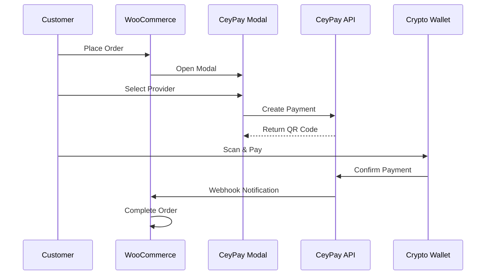

Access CeyPay settings by navigating to **WooCommerce > Settings > Payments > CeyPay** in your WordPress admin.

## General Settings

<ResponseField name="Enable/Disable" type="checkbox" default="enabled">
  Controls whether CeyPay appears as a payment option at checkout. When
  disabled, customers will not see CeyPay as a payment method.
</ResponseField>

<ResponseField name="Description" type="textarea" default="Pay securely using your preferred platform.">
  The text displayed to customers when they select CeyPay at checkout. Use this to explain the payment process or highlight benefits.

  **Example descriptions:**
  - "Pay with crypto using Bybit, Binance Pay, or KuCoin"
  - "Secure cryptocurrency payment - no fees for customers"
</ResponseField>

## API Credentials

These credentials connect your WooCommerce store to the CeyPay payment network. Both fields are required for the gateway to function.

<ResponseField name="Merchant ID" type="text" required>
  Your unique merchant identifier provided by CeyPay. This ID links transactions to your merchant account.

**Where to find it:** Log in to your [CeyPay Dashboard](https://ceypay.io) and navigate to Settings > API Credentials.

</ResponseField>

<ResponseField name="Webhook Secret" type="password" required>
  A secret key used to verify that incoming webhook notifications are genuinely from CeyPay. This prevents fraudulent payment confirmations.

**Security Note:** Keep this value secret. Never share it publicly or commit it to version control.

</ResponseField>

<Warning>
  If either Merchant ID or Webhook Secret is missing, an "Action Needed" badge
  will appear next to CeyPay in the payment methods list, and an admin notice
  will prompt you to complete the configuration.
</Warning>

## Test Mode

Test Mode allows you to verify your integration without processing real transactions.

<ResponseField name="Enable Test Mode" type="checkbox" default="disabled">
  When enabled, CeyPay uses a test API endpoint instead of the production
  server. This allows you to simulate the entire payment flow.
</ResponseField>

### Test Mode Behavior

When Test Mode is active:

| Feature          | Behavior                                                 |
| ---------------- | -------------------------------------------------------- |
| **API Endpoint** | Connects to the CeyPay test server                       |
| **Visibility**   | Only administrators can see CeyPay at checkout           |
| **Simulation**   | A "Simulate Success" button appears in the payment modal |
| **Logging**      | Debug information is written to WooCommerce logs         |

<Info>
  Test Mode uses a predefined webhook secret (`mock_secret_key`) for signature
  verification, so you don't need to configure separate test credentials.
</Info>

## Supported Providers

CeyPay supports the following cryptocurrency payment providers:

<CardGroup cols={3}>
  <Card>
    <div
      style={{
        display: "flex",
        justifyContent: "center",
        alignItems: "center",
        padding: "20px",
      }}
    >
      
      
    </div>
  </Card>
  <Card>
    <div
      style={{
        display: "flex",
        justifyContent: "center",
        alignItems: "center",
        padding: "20px",
      }}
    >
      
      
    </div>
  </Card>
  <Card>
    <div
      style={{
        display: "flex",
        justifyContent: "center",
        alignItems: "center",
        padding: "20px",
      }}
    >
      
      
    </div>
  </Card>
</CardGroup>

Customers select their preferred provider in the payment modal after clicking "Place Order". Each provider generates a unique QR code that can be scanned with the corresponding wallet app.

## Checkout Experience

### Classic Checkout

On the traditional WooCommerce checkout page, CeyPay displays:

1. **Gateway Title** - Shown as a logo for better brand recognition
2. **Description** - Your configured description text
3. **Provider Selection** - Presented in a modal after order placement

### WooCommerce Blocks Checkout

CeyPay fully supports the modern WooCommerce Blocks checkout:

- Seamless integration with the block-based checkout editor
- Same modal-based provider selection flow
- Full support for the Checkout Block and Cart Block

<Note>
  If using WooCommerce Blocks, ensure your theme and other plugins are
  compatible with the Blocks checkout for the best experience.
</Note>

## Order Processing

### Payment Flow



### Order Statuses

| Status              | When Applied                                           |
| ------------------- | ------------------------------------------------------ |
| **Pending Payment** | Order created, awaiting provider selection             |
| **Processing**      | Payment confirmed via webhook or polling               |
| **Completed**       | Order fulfilled (depends on your WooCommerce settings) |
| **Failed**          | Payment expired or was declined                        |

## Webhook URL

CeyPay sends payment notifications to your store's webhook endpoint. This URL is automatically configured and follows the pattern:

```
https://yoursite.com/?wc-api=WC_Gateway_CeyPay
```

<Tip>
  You don't need to manually configure this URL. WooCommerce handles it
  automatically. Just ensure your site is accessible from the internet.
</Tip>

## Next Steps

<CardGroup cols={2}>
  <Card title="Webhook Reference" icon="webhook" href="/wordpress/webhooks">
    Technical details about webhook payloads and signature verification.
  </Card>
  <Card title="Testing" icon="flask" href="/wordpress/testing">
    Learn how to test payments before going live.
  </Card>
</CardGroup>
